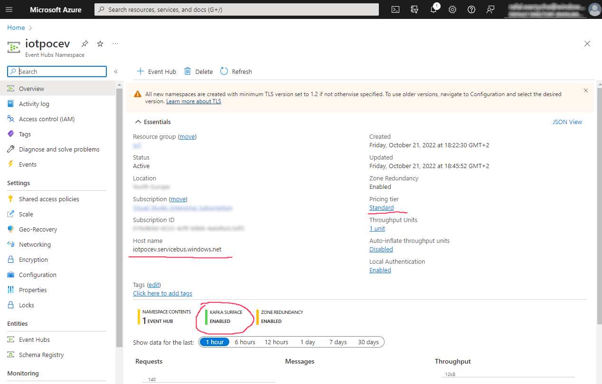
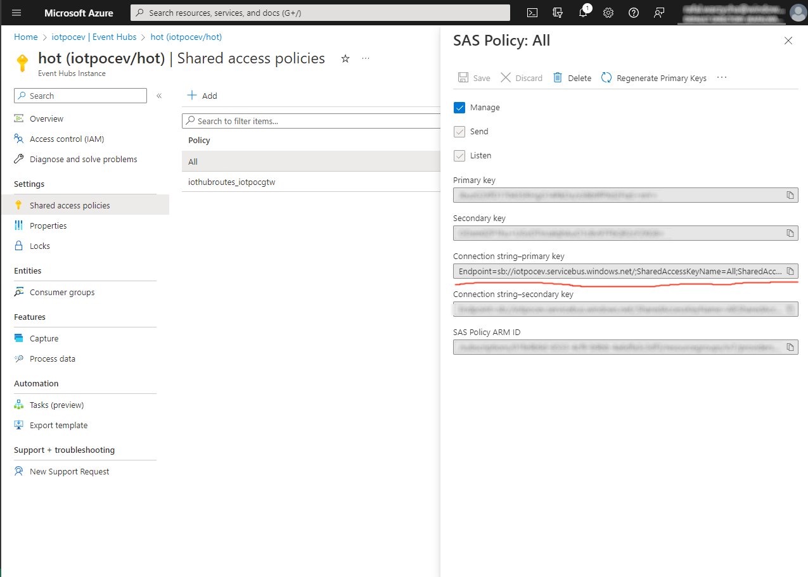
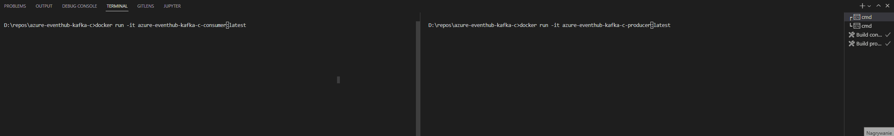

# Sample C/C++ consumer and producer implementation for Azure EventHub with Kafka surface

Since there I wasn't able to find any exisiting libraries for connecting to Azure [EventHub](https://learn.microsoft.com/en-us/azure/event-hubs/) from C/C++ using native [EventHub Kafka surface](https://learn.microsoft.com/en-us/azure/event-hubs/event-hubs-for-kafka-ecosystem-overview) capabilities and using `librdkafka` to achive it. 

> Exisiting EventHub AMQP capacities could be used to reach the same level using either [`azure-uamqp-c`](https://github.com/Azure/azure-uamqp-c) or [`Qpid Proton`](https://qpid.apache.org/proton/index.html)

## Azure EventHub setup

https://learn.microsoft.com/en-us/azure/event-hubs/event-hubs-create

> Create EventHub Namespace with minimum **Standard** tier since Kafka Surface is not avaiaible in Basic tier.



After creating *EventHub* within *EventHub Namespace* for the configuration we will need *Hostname* and Shared access policies *Connection String*.




## Build and run

Copy `getting-started.ini.sample` file to `getting-started.ini` and update fields with `XXXXXX` based on the information from *EventHub* configuration.

> Examples assumes the *Event Hub name* (topic name) is `purchases`.

### Consumer

```
docker build -f Dockerfile.consumer . azure-eventhub-kafka-c-consumer:latest
```

```
docker run azure-eventhub-kafka-c-consumer:latest
```

### Producer
```
docker build -f Dockerfile.producer . azure-eventhub-kafka-c-producer:latest
```

```
docker run azure-eventhub-kafka-c-producer:latest
```



## Materials and references

* https://learn.microsoft.com/en-us/azure/event-hubs/event-hubs-for-kafka-ecosystem-overview
* https://learn.microsoft.com/en-us/azure/event-hubs/event-hubs-kafka-connect-debezium
* https://docs.confluent.io/kafka-clients/librdkafka/current/overview.html
* https://developer.confluent.io/get-started/c/#introduction
* https://packages.debian.org/pl/sid/librdkafka-dev
* https://github.com/edenhill/librdkafka
* https://github.com/Azure/azure-event-hubs-for-kafka/tree/master/quickstart/java
* https://github.com/Azure/azure-event-hubs-for-kafka/tree/master/quickstart/kafkacat
